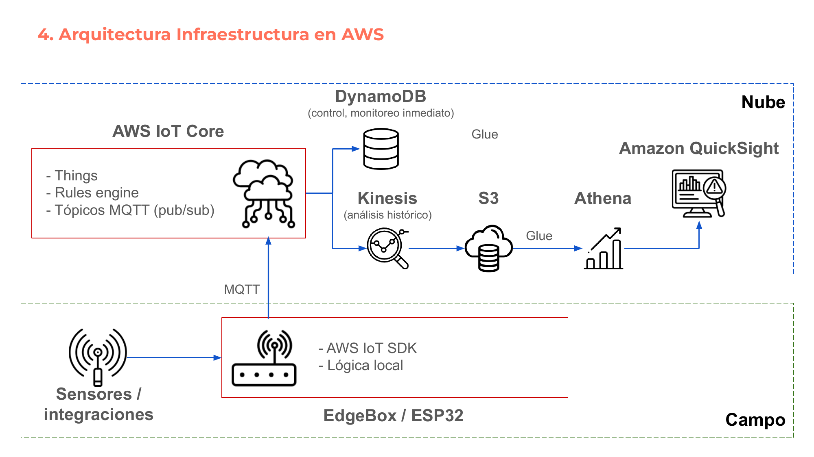
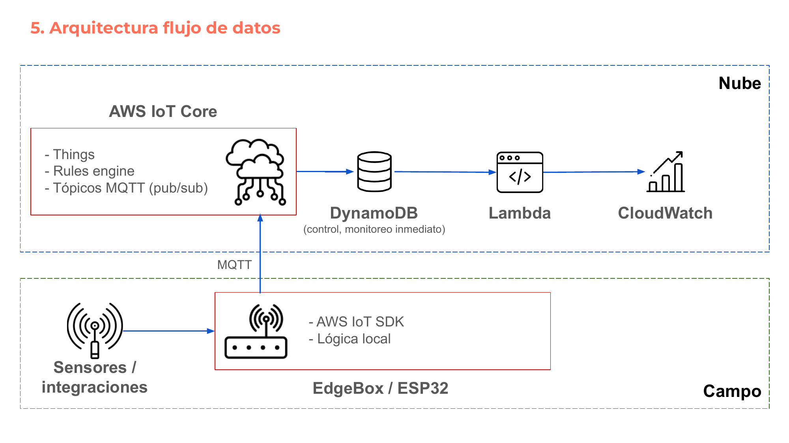
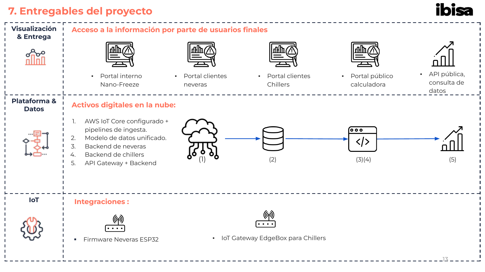
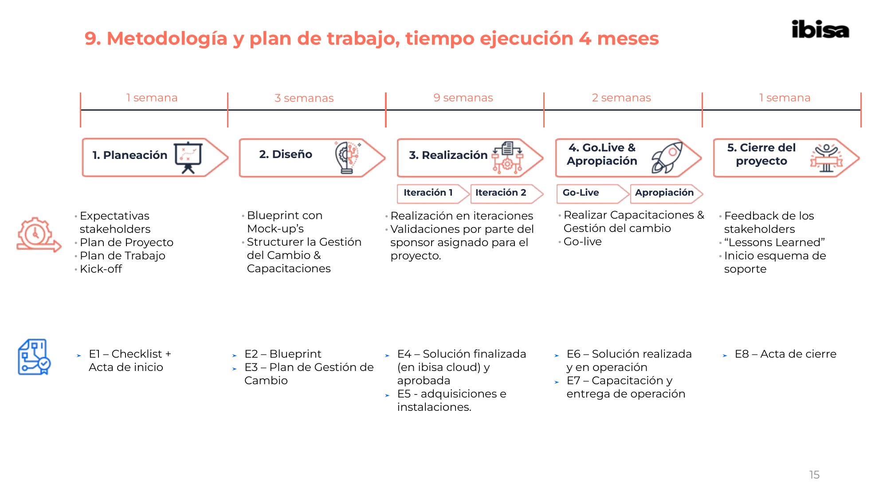
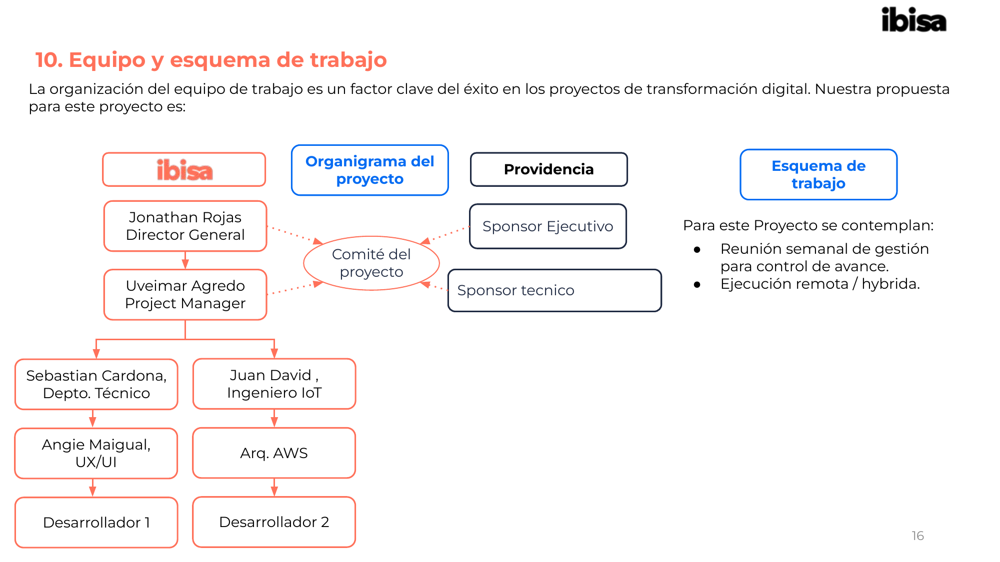

# Cotización — Plataforma Digital Nano Freeze

> Fuente: `COT - 0223 v2 Nano Freeze.pptx.pdf`
>
> Imagenes de referencia: [`Docs/COT_Nano_Freeze/`](./COT_Nano_Freeze/) (20 paginas PNG)

> **Diseño visual del documento:** Presentacion con fondo blanco, acentos en coral/rojo-naranja `#FF6B5B` para titulos de seccion, recuadros con borde naranja redondeado para las secciones de alcance (paginas 4-6), tablas con filas alternadas gris claro/blanco, motivo decorativo de tres puntos coral (●●●) en esquinas, y una ilustracion 3D isometrica en la portada mostrando capas de una plataforma digital (personas, pantallas, engranajes, datos). Logo Ibisa en esquina inferior derecha. Logo "ibisa" en minusculas bold naranja/negro.

**Documento:** COT. 0232 - 20251118
**De:** IBISA Group SAS
**Para:** Nano Freeze — Att. Ing. Isabel Pulido
**Fecha:** Bogotá D.C., 18 de noviembre 2025

---

Señores Nano Freeze,

De acuerdo con nuestras reuniones y entendimiento, ponemos a su consideración nuestra propuesta para el diseño, implementación, puesta en servicio y entrega en operación de una plataforma digital que permita a Nano Freeze tener trazabilidad y visibilidad de las operaciones con sus clientes.

**Jonathan Rojas B.**
Director General — jonathan.rojas@ibisa.co — Cel: (+57) 315 221 6579

---

## 1. Nuestro entendimiento de su necesidad

Nano Freeze quiere desarrollar su solución de monitoreo energético para neveras y chillers, integrando hardware inteligente, firmware robusto y una plataforma SaaS multi-tenant capaz de medir, visualizar y optimizar el consumo energético en tiempo real.

Actualmente usan soluciones de smart plugs con limitaciones (solo 110 V, sin monitoreo de temperatura, sin plataforma robusta), lo cual deja un espacio claro para un producto integral que:

- ✔ Mida consumo energético (kW, kWh) y temperatura (-30°C a 40°C)
- ✔ Controle el flujo eléctrico mediante relé
- ✔ Funcione entre 110–240 V, 50/60 Hz con enchufe universal
- ✔ Se conecte vía WiFi + MQTT a una plataforma IoT en la nube
- ✔ Permita estrategias de ahorro energético superiores al 20%
- ✔ Entregue reportes M&V, CO₂ evitado, ahorro monetario y KPIs
- ✔ Sea escalable para grandes clientes de retail, agro y sector público

Adicionalmente, la plataforma deberá ofrecer:

- SaaS multi-tenant con usuarios, permisos y aislamiento de datos.
- Dashboards para neveras y chillers.
- API Gateway para integraciones.
- Calculadora pública de CO₂ y ahorro energético.
- Reportería descargable (M&V, auditoría, consumo, temperatura).

El proyecto contempla hardware, firmware, backend, frontend, infraestructura y puesta en producción.

---

## 2. Alcance y actividades incluidas en nuestra oferta

### 2.1 Firmware IoT para Neveras (ESP32 + WiFi MQTT)

Desarrollo completo del firmware embebido para el dispositivo inteligente:

- Lectura de potencia (kW), energía (kWh), corriente, voltaje, PF.
- Lectura de temperatura mediante sonda NTC (-30°C a 40°C).
- Comunicación segura MQTT → AWS IoT Core.
- Control del relé según lógica local/remota.
- OTA con fallback firmware y watchdog hardware.
- Protección ante fallas, reconexión y operación offline.

### 2.2 Appliances HW + Firmware Edge Chillers

Para chillers industriales:

- Integración con sensores externos (T°, potencia).
- Conectividad Modbus RTU/TCP, OPC para equipos existentes.
- Device class "Chiller" con variaciones de parámetros.
- Persistencia local de datos para evitar pérdidas con caídas de comunicaciones.
- Protocolo IoT compatible con servicios nativos de nube AWS.
- Tarjetas SIM celular embebidas para comunicaciones con nube.
- Telegestión + auto diagnóstico operativo.
- Alarmas y notificaciones.

### 2.3 AWS IoT & Data Platform Setup

Incluye arquitectura, implementación y despliegue:

- AWS IoT Core
- Time-series DB
- Data Lake S3 + Glue catalog.
- Lambdas de ingesta, normalización y cálculo de KPIs.
- API Gateway (REST/GraphQL).
- RDS PostgreSQL para configuración, tarifas y usuarios.
- Cognito + RBAC + MFA.
- Observabilidad (CloudWatch, X-Ray, Logs).
- Seguridad.

### 2.4 Diseño + Implementación del Modelo de Datos

Modelo unificado para neveras y chillers:

- Equipos, sitios y clientes (multi-tenant).
- Mediciones en tiempo real (kW, kWh, T°, estados).
- Tarifas y factores de emisión por región.
- Línea base energética.
- Ahorros energéticos, monetarios y CO₂ evitado.
- Auditoría completa de cambios.

Incluye scripts, normalización y reglas de cálculo.

### 2.5 Multitenant Setup + User Management

- Arquitectura SaaS multi-tenant.
- Separación lógica por cliente.
- Roles: Admin, Operaciones, Lectura, Invitado.
- SSO corporativo opcional.
- Gestión de usuarios, permisos y trazabilidad.

### 2.6 Public Front + Calculadora Pública

Una aplicación web pública sin login:

- Cálculo de huella de carbono por país.
- Estimación monetaria del consumo.
- Escenarios de ahorro (10-20-30%).
- Seguridad: rate limiting, captcha, no tracking personal.

### 2.7 Portal de Neveras (Front + Back)

**Front-end:**

- Dashboard por equipo.
- Medición en tiempo real (T°, kW).
- Históricos (minuto, hora, mes).
- KPIs: ahorro, CO₂ evitado, ciclos.
- Alertas: consumo anómalo, T° fuera de rango.
- Reportes descargables (PDF/Excel).

**Backend:**

- Endpoints REST/GraphQL.
- Motor de línea base y cálculo de ahorros.
- Tarifas TOU.
- Validación y limpieza de datos.
- APIs para integraciones externas.

### 2.8 Portal de Chillers (Front + Back)

Similar a neveras, con funcionalidades adicionales:

- Integración con Modbus (via Edge device).
- KPIs térmicos avanzados (eficiencia, COP estimado).
- Alarmas industriales.

### 2.9 API Gateway

- Exposición segura de APIs a terceros.
- Autenticación JWT/Cognito.
- Límite de rate y cuoteo por cliente.
- Versionamiento y documentación (Swagger / Redoc).

---

## 3. Checklist de entregables

| Categoría | Entregable |
|-----------|-----------|
| Firmware | Firmware IoT para neveras (ESP32) con MQTT, OTA, relé, T°, energía. |
| Firmware | Firmware Edge para chillers (Modbus, T°, energía). |
| Cloud | AWS IoT Core configurado + pipelines de ingesta. |
| Cloud | Time-series DB (Timestream) + Data Lake S3. |
| Cloud | API Gateway + Backend (Lambdas/ECS) + RDS PostgreSQL. |
| Data | Modelo de datos unificado + scripts de ingestión/normalización. |
| SaaS | Infraestructura multi-tenant + users + roles + permisos. |
| Front | Portal público con calculadora ahorros y CO₂. |
| Front | Portal de neveras (UI/UX, dashboards, reportes). |
| Back | Backend de neveras con cálculos de línea base y ahorros. |
| Front | Portal de chillers (UI/UX, dashboards industriales). |
| Back | Backend de chillers (Modbus, alarmas, cálculos). |
| Infra | Monitoreo, seguridad, logs, backups, DR. |
| QA | Piloto técnico, pruebas en campo, optimización. |
| Go-live | Deployment en producción + documentación + soporte inicial. |

---

## 4. Arquitectura Infraestructura en AWS



> **Descripcion visual del diagrama:** El diagrama divide la arquitectura en dos zonas claramente separadas mediante recuadros con borde azul punteado. Cada servicio AWS se representa con un icono descriptivo junto a su nombre.

```
┌─ ─ ─ ─ ─ ─ ─ ─ ─ ─ ─ ─ ─ ─ ─ ─ ─ ─ ─ ─ ─ ─ ─ ─ ─ ─ ─ ─ ─ ─ ─ ─ ─ ─ ─ ─ ─ ┐
│                                                                        Nube     │
│                                                                                 │
│   ┌──────────────────────┐      ┌──────────────┐                                │
│   │   AWS IoT Core       │      │  DynamoDB     │          Glue                  │
│   │  ☁ (icono nube con   │─────►│  🗄 (cilindro │─────────────────┐              │
│   │   conexiones)        │      │   base datos) │                 │              │
│   │                      │      │  (control,    │   ┌─────────────────────────┐  │
│   │  - Things            │      │   monitoreo   │   │  Amazon QuickSight      │  │
│   │  - Rules engine      │      │   inmediato)  │   │  🖥 (monitor con        │  │
│   │  - Tópicos MQTT      │      └──────────────┘   │   graficas y alertas)   │  │
│   │    (pub/sub)         │                          └─────────────────────────┘  │
│   └──────────┬───────────┘                                    ▲                  │
│              │                                                │                  │
│              │      ┌──────────────┐   ┌──────────┐   ┌──────────┐              │
│              ├─────►│  Kinesis      │──►│  S3      │──►│  Athena  │              │
│              │      │  🔍 (lupa con │   │  ☁ (nube │   │  📊 (graf│              │
│              │      │   reloj,      │   │   con    │   │   ascen- │              │
│              │      │   analisis    │   │   datos) │   │   dente) │              │
│              │      │   historico)  │   └────┬─────┘   └──────────┘              │
│              │      └──────────────┘        │                                    │
│              │                              │ Glue                               │
│              │                              │ (catalogo)                          │
└─ ─ ─ ─ ─ ─ ─│─ ─ ─ ─ ─ ─ ─ ─ ─ ─ ─ ─ ─ ─ ─ ─ ─ ─ ─ ─ ─ ─ ─ ─ ─ ─ ─ ─ ─ ─ ┘
               │
             MQTT ▲
               │
┌─ ─ ─ ─ ─ ─ ─│─ ─ ─ ─ ─ ─ ─ ─ ─ ─ ─ ─ ─ ─ ─ ─ ─ ─ ─ ─ ─ ─ ─ ─ ─ ─ ─ ─ ─ ─ ┐
│              │                                                       Campo      │
│                                                                                 │
│   📡               ┌──────────────────────┐                                     │
│   Sensores /  ────►│  EdgeBox / ESP32      │                                     │
│   integraciones    │  📶 (router con       │                                     │
│   (icono antena    │   antena WiFi)        │                                     │
│    con ondas)      │                       │                                     │
│                    │  - AWS IoT SDK        │                                     │
│                    │  - Lógica local       │                                     │
│                    └──────────────────────┘                                      │
└─ ─ ─ ─ ─ ─ ─ ─ ─ ─ ─ ─ ─ ─ ─ ─ ─ ─ ─ ─ ─ ─ ─ ─ ─ ─ ─ ─ ─ ─ ─ ─ ─ ─ ─ ─ ─ ┘
```

**Descripcion de componentes visuales:**
- **Zona "Nube"** (recuadro azul punteado, parte superior): Contiene todos los servicios AWS. AWS IoT Core se muestra dentro de un recuadro rojo con icono de nube con conexiones. Las flechas azules indican flujo de datos.
- **Zona "Campo"** (recuadro verde punteado, parte inferior): Contiene los sensores (icono de antena con ondas de radio) y el EdgeBox/ESP32 (icono de router con antena WiFi, dentro de recuadro rojo).
- **Flujo principal:** Sensores → EdgeBox → (MQTT) → AWS IoT Core → DynamoDB (rama de monitoreo inmediato) y → Kinesis → S3 → Glue → Athena → QuickSight (rama de analisis historico).
- Las flechas son azules direccionales, indicando el flujo de datos de izquierda a derecha y de abajo hacia arriba.

---

## 5. Arquitectura flujo de datos



> **Descripcion visual del diagrama:** Similar al diagrama de infraestructura pero enfocado en el flujo de procesamiento de datos. Misma separacion en dos zonas (Nube y Campo) con bordes punteados.

```
┌─ ─ ─ ─ ─ ─ ─ ─ ─ ─ ─ ─ ─ ─ ─ ─ ─ ─ ─ ─ ─ ─ ─ ─ ─ ─ ─ ─ ─ ─ ─ ─ ─ ─ ─ ─ ─ ┐
│                                                                        Nube     │
│                                                                                 │
│   ┌──────────────────────┐                                                      │
│   │   AWS IoT Core       │                                                      │
│   │  ☁ (icono nube con   │                                                      │
│   │   conexiones)        │                                                      │
│   │                      │                                                      │
│   │  - Things            │      ┌──────────┐   ┌──────────┐   ┌─────────────┐   │
│   │  - Rules engine      │─────►│ DynamoDB  │──►│  Lambda   │──►│ CloudWatch  │   │
│   │  - Tópicos MQTT      │      │ 🗄 (cilin-│   │ </> (eti-│   │ 📈 (grafica │   │
│   │    (pub/sub)         │      │  dro BD)  │   │  queta   │   │  ascendente)│   │
│   └──────────┬───────────┘      │ (control, │   │  codigo) │   └─────────────┘   │
│              │                  │  monitoreo│   └──────────┘                     │
│              │                  │  inmediato)│                                    │
│              │                  └──────────┘                                     │
└─ ─ ─ ─ ─ ─ ─│─ ─ ─ ─ ─ ─ ─ ─ ─ ─ ─ ─ ─ ─ ─ ─ ─ ─ ─ ─ ─ ─ ─ ─ ─ ─ ─ ─ ─ ─ ┘
               │
             MQTT ▲
               │
┌─ ─ ─ ─ ─ ─ ─│─ ─ ─ ─ ─ ─ ─ ─ ─ ─ ─ ─ ─ ─ ─ ─ ─ ─ ─ ─ ─ ─ ─ ─ ─ ─ ─ ─ ─ ─ ┐
│              │                                                       Campo      │
│                                                                                 │
│   📡               ┌──────────────────────┐                                     │
│   Sensores /  ────►│  EdgeBox / ESP32      │                                     │
│   integraciones    │  📶 (router con       │                                     │
│   (icono antena    │   antena WiFi)        │                                     │
│    con ondas)      │                       │                                     │
│                    │  - AWS IoT SDK        │                                     │
│                    │  - Lógica local       │                                     │
│                    └──────────────────────┘                                      │
└─ ─ ─ ─ ─ ─ ─ ─ ─ ─ ─ ─ ─ ─ ─ ─ ─ ─ ─ ─ ─ ─ ─ ─ ─ ─ ─ ─ ─ ─ ─ ─ ─ ─ ─ ─ ─ ┘
```

**Diferencia con la arquitectura de infraestructura (seccion 4):** Este diagrama muestra la rama de procesamiento en tiempo real: IoT Core → DynamoDB → Lambda (procesamiento con icono de etiqueta de codigo `</>`) → CloudWatch (monitoreo con icono de grafica ascendente). No incluye la rama de analisis historico (Kinesis/S3/Glue/Athena/QuickSight).

---

## 6. Principales componentes

| Componente | Función principal |
|-----------|------------------|
| Sensores | Medir variables físicas (energía, temperatura) |
| EdgeBox (Gateway) | Recolectar, transformar y enviar datos a la nube por MQTT |
| AWS IoT Core | Conectar los dispositivos físicos a la nube de forma segura |
| DynamoDB | Almacenar y consultar el estado actual de los dispositivos |
| S3 (Simple Storage Service) | Almacenar grandes volúmenes de datos para análisis posterior |
| Glue | Preparar y catalogar los datos para que puedan ser consultados |
| Athena | Consultar y analizar los datos usando SQL |
| QuickSight | Visualizar los datos en dashboards |

---

## 7. Entregables del proyecto



> **Descripcion visual:** El diagrama de entregables se organiza en tres filas horizontales (tiers) separadas por lineas punteadas, con un icono representativo a la izquierda de cada fila y el contenido a la derecha. La estructura visual comunica las capas de la solucion de arriba (usuario) hacia abajo (hardware).

### Tier 1 — Visualización & Entrega

**Icono de fila:** Grafico de barras con personas (coral/naranja).

Acceso a la información por parte de usuarios finales. Se muestran **5 iconos de monitor/pantalla** en fila horizontal, cada uno con un icono distinto encima (alertas, edificio, lupa, calculadora, grafica ascendente):

- Portal interno Nano-Freeze
- Portal clientes neveras
- Portal clientes Chillers
- Portal público calculadora
- API pública, consulta de datos

### Tier 2 — Plataforma & Datos

**Icono de fila:** Diagrama de flujo con nodos conectados (coral/naranja).

Activos digitales en la nube. Se muestra un **flujo visual horizontal** con 4 iconos conectados por flechas azules, cada uno numerado:

```
  ☁ (1)  ──────►  🗄 (2)  ──────►  </> (3)(4)  ──────►  📈 (5)
  IoT Core       Base datos       Backend/API         Dashboards
```

1. AWS IoT Core configurado + pipelines de ingesta.
2. Modelo de datos unificado.
3. Backend de neveras.
4. Backend de chillers.
5. API Gateway + Backend.

### Tier 3 — IoT — Integraciones

**Icono de fila:** Engranaje con llama/herramienta (coral/naranja, representando IoT/hardware).

Se muestran **2 iconos de router/gateway** con antena WiFi:

- Firmware Neveras ESP32
- IoT Gateway EdgeBox para Chillers

---

## 8. Acompañamiento pilotos — línea industrial

Nuestra oferta incluye los servicios de acompañamiento y suministro de los siguientes equipos, para acompañar a Nano Freeze en el desarrollo de los primeros 3 pilotos con clientes de Chillers.

1. Acompañamiento/entrenamiento en Bogotá para preparación, adecuación y puesta en funcionamiento de los IoT EdgeBox.
2. Facilitar plataforma Ibisa para pruebas o pilotos previos a plataforma propia Nano Freeze.

---

## 9. Metodología y plan de trabajo



**Tiempo de ejecución: 4 meses**

> **Descripcion visual del timeline:** El diagrama muestra una **linea de tiempo Gantt horizontal** con 5 fases representadas como flechas/chevrones en coral/naranja, cada una con un icono distinto. Encima de cada fase se indica la duracion en texto coral. Debajo de cada fase, las actividades en texto negro y los entregables (E1-E8) con icono de checklist azul.

```
  1 semana        3 semanas           9 semanas           2 semanas       1 semana
├───────────┤├─────────────────┤├──────────────────────┤├──────────────┤├───────────┤

┌───────────►┌─────────────────►┌──────────────────────►┌──────────────►┌───────────►
│ 1. Planea- ││ 2. Diseño       ││ 3. Realización       ││ 4. Go.Live & ││ 5. Cierre │
│    ción    ││   💡             ││   🧱                  ││  Apropiación ││  del      │
│ 📋         ││                  ││  ┌────────┬────────┐ ││ 🚀           ││  proyecto │
└────────────┘└──────────────────┘│  │Iter. 1 │Iter. 2 │ │└──────────────┘│ 🎓       │
                                  │  └────────┴────────┘ │               └───────────┘
                                  └──────────────────────┘
```

**Iconos por fase (en el mockup original, cada flecha tiene un icono unico):**
1. **Planeacion** — icono de portapapeles/checklist
2. **Diseno** — icono de bombilla (idea)
3. **Realizacion** — icono de bloques de construccion (con sub-flechas "Iteracion 1" e "Iteracion 2")
4. **Go-Live & Apropiacion** — icono de cohete (con sub-flechas "Go-Live" y "Apropiacion")
5. **Cierre del proyecto** — icono de birrete/graduacion

| Fase | Duración | Actividades | Entregables |
|------|----------|-------------|-------------|
| 1. Planeación | 1 semana | Expectativas stakeholders, Plan de Proyecto, Plan de Trabajo, Kick-off | E1 – Checklist + Acta de inicio |
| 2. Diseño | 3 semanas | Blueprint con Mock-up's, Estructurar la Gestión del Cambio & Capacitaciones | E2 – Blueprint, E3 – Plan de Gestión de Cambio |
| 3. Realización | 9 semanas | Realización en iteraciones (Iteración 1, Iteración 2), Validaciones por parte del sponsor asignado | E4 – Solución finalizada (en Ibisa cloud) y aprobada, E5 – Adquisiciones e instalaciones |
| 4. Go-Live & Apropiación | 2 semanas | Realizar Capacitaciones & Gestión del cambio, Go-live | E6 – Solución realizada y en operación, E7 – Capacitación y entrega de operación |
| 5. Cierre del proyecto | 1 semana | Feedback de los stakeholders, "Lessons Learned", Inicio esquema de soporte | E8 – Acta de cierre |

---

## 10. Equipo y esquema de trabajo



> **Descripcion visual:** La pagina se divide en tres secciones horizontales: "Organigrama del proyecto" (izquierda), "Providencia" (centro), y "Esquema de trabajo" (derecha). Los recuadros del organigrama tienen borde coral/naranja con fondo blanco. El "Comite del proyecto" se muestra como un ovalo rojo con borde punteado, conectado mediante **lineas punteadas** (relaciones de gobernanza) a Jonathan Rojas y Uveimar Agredo. Las lineas solidas indican reporte directo.

### Organigrama del proyecto

```
                    ┌─────────────────┐
                    │    ibisa        │
                    └────────┬────────┘
                             │
                    ┌────────▼────────┐         ╭ ─ ─ ─ ─ ─ ─ ─ ╮
                    │ Jonathan Rojas  │· · · · ·   Comité del    │
                    │ Director General│         │   proyecto
                    └────────┬────────┘         ╰ ─ ─ ─ ┬─ ─ ─ ╯
                             │                    · · · ·│· · · ·
                    ┌────────▼────────┐                  │
                    │ Uveimar Agredo  │· · · · · · · · · ┘
                    │ Project Manager │        (líneas punteadas =
                    └───┬─────────┬───┘         gobernanza)
                        │         │
            ┌───────────▼──┐  ┌──▼───────────┐
            │ Sebastian    │  │ Juan David   │
            │ Cardona      │  │ Ingeniero IoT│
            │ Depto.Técnico│  └──┬───────────┘
            └───┬──────────┘     │
                │                │
            ┌───▼──────────┐  ┌──▼───────────┐
            │ Angie Maigual│  │ Arq. AWS     │
            │ UX/UI        │  └──┬───────────┘
            └───┬──────────┘     │
                │                │
            ┌───▼──────────┐  ┌──▼───────────┐
            │Desarrollador 1│  │Desarrollador 2│
            └──────────────┘  └──────────────┘
```

**Nota sobre la estructura visual:** En el diagrama original, Sebastian Cardona y Juan David forman dos ramas paralelas bajo Uveimar Agredo. Cada rama tiene su jerarquia vertical:
- **Rama 1 (izquierda):** Sebastian Cardona → Angie Maigual → Desarrollador 1
- **Rama 2 (derecha):** Juan David → Arq. AWS → Desarrollador 2

### Providencia (Cliente)

| Rol | Descripcion |
|-----|-------------|
| **Sponsor Ejecutivo** | Representante ejecutivo de Providencia/Nano Freeze |
| **Sponsor Técnico** | Representante tecnico, conectado al Comite del proyecto |

El Comite del proyecto (ovalo con borde punteado rojo) funciona como organo de gobernanza que conecta al Director General y al PM de Ibisa con los sponsors del cliente mediante lineas punteadas (relaciones consultivas, no de reporte directo).

### Esquema de trabajo

- Reunión semanal de gestión para control de avance.
- Ejecución remota / híbrida.

---

## 11. Oferta económica

**Tabla 1. Inversión CAPEX para desarrollo de Plataforma Digital Nano Freeze**

| Entregable | Valor (COP) |
|-----------|-------------|
| Firmware IoT Neveras sobre ESP32 + WiFi MQTT | $9.000.000 |
| Appliance HW + Firmware Edge Chillers | $26.000.000 |
| AWS IoT & Data Platform setup | $40.000.000 |
| Diseño + Implementación - Modelo de Datos | $16.000.000 |
| Multi Tenant setup - user management | $16.000.000 |
| Public Front + Calculator | $5.600.000 |
| Neveras portal Front | $11.200.000 |
| Neveras portal Back | $14.000.000 |
| Chillers portal Front | $11.200.000 |
| Chillers portal Back | $14.000.000 |
| API Gateway | $6.000.000 |
| Acompañamiento puesta en marcha línea industrial | $27.000.000 |
| **Total plataforma Digital NanoFreeze** | **$196.000.000** |

### Notas comerciales

- Los valores **no incluyen IVA**.
- Hitos de pago:
  - Factura inicial por 40% del proyecto.
  - Facturas mensuales acorde a % de avance.
- Los gastos se estiman según premisas acordadas. Si se requieren viajes adicionales a los previstos, las dos partes acuerdan el manejo de los gastos adicionales.
- Las facturas pagaderas dentro de los 15 días después de la radicación.

---

## 12. Términos y condiciones

### Confidencialidad de la información privilegiada

IBISA Group SAS (en adelante "IBISA") se obliga a mantener la confidencialidad de toda la información técnica, comercial o estratégica suministrada por el CLIENTE en el marco de la presente oferta. Dicha información será utilizada exclusivamente para el cumplimiento del objeto contractual y no será divulgada a terceros sin autorización previa y escrita de la otra parte, salvo obligación legal.

### Propiedad Intelectual y Derechos sobre los Entregables

Los desarrollos, entregables, documentos técnicos, código fuente, configuraciones, bases de datos estructurales, manuales y demás productos generados específicamente en ejecución del proyecto (en adelante, los "Entregables"), serán cedidos al CLIENTE en los términos establecidos en el contrato definitivo, incluyendo los derechos patrimoniales de autor, sin limitación territorial y por el término máximo permitido por la ley.

La cesión comprenderá las facultades de uso, reproducción, adaptación, modificación, distribución, comunicación pública y transformación de los Entregables, para los fines propios del proyecto y de la operación del CLIENTE.

No obstante lo anterior, IBISA conservará la titularidad sobre su know-how, metodologías, herramientas, frameworks, librerías, plantillas, conectores y desarrollos preexistentes, componentes genéricos, reutilizables o de uso transversal desarrollados con anterioridad al proyecto o de forma independiente a este.

Software o servicios tecnológicos de terceros utilizado en el desarrollo se regirá por sus respectivas licencias.

IBISA garantiza que los Entregables desarrollados específicamente para el proyecto no infringen derechos de propiedad intelectual de terceros.

### Habeas Data y protección de datos personales

IBISA se compromete a cumplir con la normativa vigente en materia de protección de datos personales, implementando medidas técnicas y organizativas razonables para garantizar la seguridad y confidencialidad de la información tratada en el marco del proyecto.

### Limitación de Responsabilidad

IBISA será responsable frente al CLIENTE de los daños que se deriven del incumplimiento por su parte de las obligaciones derivadas del presente Contrato hasta el límite del importe de las cantidades que haya abonado el CLIENTE por concepto de servicios prestados por IBISA durante la anualidad en la que se produce el hecho generador del daño. En ningún caso responderá IBISA por daños indirectos, lucro cesante o pérdida de oportunidad.

### Manejo de Autorización y legalización de adicionales

Si durante la ejecución resultan necesarias actividades o trabajos por fuera del objeto y/o alcance de la presente oferta, el CONTRATISTA informará por escrito de esta situación al CLIENTE de manera inmediata y previa a su iniciación. Siempre se requerirá contar con la aprobación expresa y por escrito por parte del CLIENTE de estas obras y/o trabajos adicionales, y con ello la modificación por escrito del objeto y/o alcance y del monto del Contrato. De no contar con la autorización previa, expresa y por escrito del CONTRATANTE, las partes aceptan que la ejecución de actividades adicionales constituye un acto de mera liberalidad del Contratista, bajo su propia cuenta y riesgo, que en ningún momento obliga al Contratante a su pago.

### Tiempo de Garantía

6 meses. La garantía aplicable a los desarrollos de software cubrirá exclusivamente defectos atribuibles al código entregado, dentro del plazo que se establezca en el contrato definitivo. No incluye nuevas funcionalidades, ajustes derivados de cambios en requerimientos ni modificaciones posteriores.

---

**IBISA Group SAS**
www.ibisagroup.com — jonathan.rojas@ibisa.co — (+57) 315 221 6579
