# Mockup Nano Freeze

> Fuente: `Mockup Nano Freeze.pdf`
>
> Imagenes de referencia: [`Docs/Mockup_Nano_Freeze/`](./Mockup_Nano_Freeze/) (30 paginas PNG)

**Documento:** Mockups (Portales NanoFreeze)
**Proyecto:** Plataforma Digital Nano Freeze
**Cliente:** NanoFreeze
**Version:** 09.02.2026
**Project Manager:** Juan David Ruiz (Ibisa Group)
**Responsable de Proyecto:** Isabel Pulido (Nano Freeze)

---

## 0. Sistema de Diseno

### Paleta de colores

| Token | Color | Uso |
|-------|-------|-----|
| `--sidebar-bg` | Navy oscuro `#1a2a47` | Fondo del sidebar lateral |
| `--accent` | Coral/salmon `#FF6B5B` | Titulos de seccion en la presentacion, badges criticos |
| `--primary` | Teal/turquesa `#2CBCB6` | Graficas de barras, botones principales, badges "Activo"/"Online" |
| `--surface` | Gris claro `#F5F5F5` | Fondo general del area de contenido |
| `--card-bg` | Blanco `#FFFFFF` | Tarjetas KPI, tablas, modales |
| `--text-primary` | Gris oscuro `#333333` | Texto principal en contenido |
| `--text-sidebar` | Blanco `#FFFFFF` | Texto e iconos en sidebar |
| `--danger` | Rojo `#E53935` | Badges "Critico", "Offline", "En Mora" |
| `--warning` | Naranja/ambar `#FFA726` | Badges "Advertencia" |
| `--success` | Verde `#4CAF50` | Badges "Activo", "Al Dia", "Online" |
| `--chart-blue` | Azul claro `#4FC3F7` | Graficas de linea (temperatura) |

### Tipografia

- Titulos de pagina: Sans-serif bold, ~24px, color gris oscuro
- Subtitulos de seccion: Sans-serif semibold, ~18px
- Texto cuerpo/tablas: Sans-serif regular, ~14px
- Etiquetas KPI: Sans-serif uppercase, ~11px, color gris medio
- Valores KPI: Sans-serif bold, ~28-32px

### Componentes reutilizables

- **Sidebar:** ~250px ancho fijo, fondo navy `#1a2a47`. En la parte superior: logo NanoFreeze (ondas blancas + texto "NANOFREEZE" + slogan *"A new way to refrigerate naturally"*). Items de navegacion con icono + texto: Inicio (casa), Reportes (documento), Alertas (campana), Configuraciones (engranaje). Debajo del cliente activo (cuando aplica): recuadro con icono edificio + nombre truncado. Pie del sidebar: avatar circular "NF" + "Admin NanoFreeze" / "Enterprise".
- **Tarjeta KPI:** Rectangulo blanco con borde sutil, ~200px ancho. Etiqueta uppercase en gris, valor numerico grande en negro, subtexto en gris pequeno, icono teal/verde a la derecha.
- **Tabla:** Headers en gris uppercase, filas alternadas blanco/gris-muy-claro, bordes redondeados. Columna "Estado" con badges de color. Columna "Accion" con botones outlined "Modificar" (icono lapiz) y "Ver" (icono ojo).
- **Boton primario:** Fondo teal oscuro `#1a2a47`, texto blanco, bordes redondeados ~6px, prefijo "+" para acciones de creacion.
- **Badge de estado:** Pill redondeado, fondo color suave con texto del mismo color: verde "Activo"/"Al Dia"/"Online", rojo "Critico"/"Offline"/"En Mora", naranja "Advertencia".
- **Modal/formulario:** Overlay semitransparente, panel blanco centrado ~500px ancho, titulo bold + descripcion gris, campos con label encima + input con placeholder gris claro + borde, botones al pie: "Cancelar" (outlined gris) + accion principal (fondo teal oscuro).
- **Breadcrumb:** `Home > Cliente > Punto de Venta > Equipo` en texto gris ~12px, elemento activo en negro.

---

## 1. Portal NanoFreeze (Admin)

### 1.1 Inicio (Vista General)

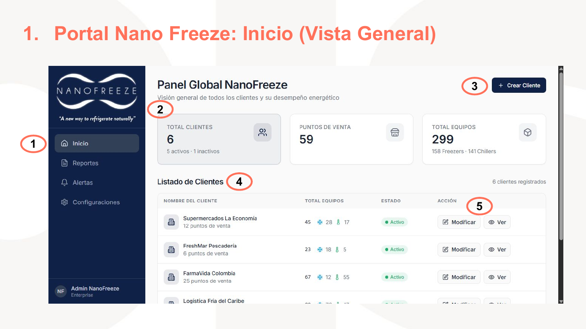

**Layout:** Sidebar navy a la izquierda (~20% del ancho). Area de contenido con fondo gris claro a la derecha (~80%).

**Encabezado del contenido:**
- Titulo: **"Panel Global NanoFreeze"** (bold, ~24px)
- Subtitulo: *"Vision general de todos los clientes y su desempeno energetico"* (gris, ~14px)
- Boton superior derecho: **"+ Crear Cliente"** (fondo navy, texto blanco)

**Fila de tarjetas KPI (3 tarjetas):**

| Tarjeta | Etiqueta | Valor | Detalle | Icono |
|---------|----------|-------|---------|-------|
| 1 | TOTAL CLIENTES | **6** | 5 activos · 1 inactivos | Personas (teal) |
| 2 | PUNTOS DE VENTA | **59** | — | Tienda (teal) |
| 3 | TOTAL EQUIPOS | **299** | 158 Freezers · 141 Chillers | Dispositivo (teal) |

**Tabla "Listado de Clientes":**
- Header derecho: *"6 clientes registrados"*
- Columnas: `NOMBRE DEL CLIENTE` | `TOTAL EQUIPOS` | `ESTADO` | `ACCION`
- Datos de ejemplo:

| Cliente | Equipos | Estado | Acciones |
|---------|---------|--------|----------|
| Supermercados La Economia (12 puntos de venta) | 45 (❄ 28, 🏭 17) | ● Activo | Modificar · Ver |
| FreshMar Pescaderia (6 puntos de venta) | 23 (❄ 18, 🏭 5) | ● Activo | Modificar · Ver |
| FarmaVida Colombia (25 puntos de venta) | 67 (❄ 12, 🏭 55) | ● Activo | Modificar · Ver |
| Logistica Fria del Caribe | (parcialmente visible) | ● Activo | Modificar · Ver |

- Los iconos ❄ y 🏭 en la columna de equipos representan Freezers y Chillers respectivamente.

**Anotaciones del mockup (circulos rojos numerados):**
1. Menu lateral persistente
2. Indicadores KPI
3. Boton "Crear Cliente"
4. Listado de clientes
5. Columna de acciones

#### Formulario: Crear Nuevo Cliente

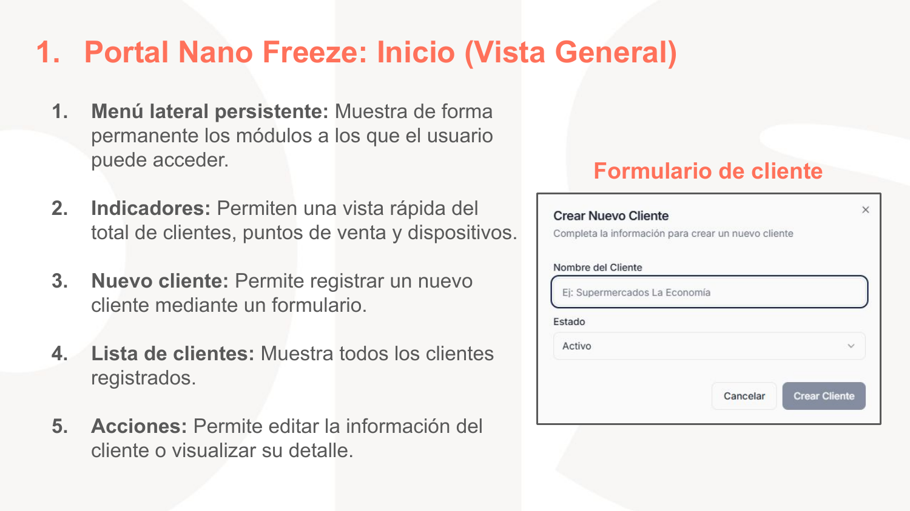

**Modal centrado sobre overlay.** Titulo: **"Crear Nuevo Cliente"**. Subtitulo: *"Completa la informacion para crear un nuevo cliente"*.

| Campo | Tipo | Placeholder |
|-------|------|-------------|
| Nombre del Cliente | Text input | `Ej: Supermercados La Economia` |
| Estado | Dropdown | `Activo` (valor default) |

**Botones:** `Cancelar` (outlined gris) | `Crear Cliente` (fondo teal oscuro, texto blanco)

---

### 1.2 Detalle por Cliente

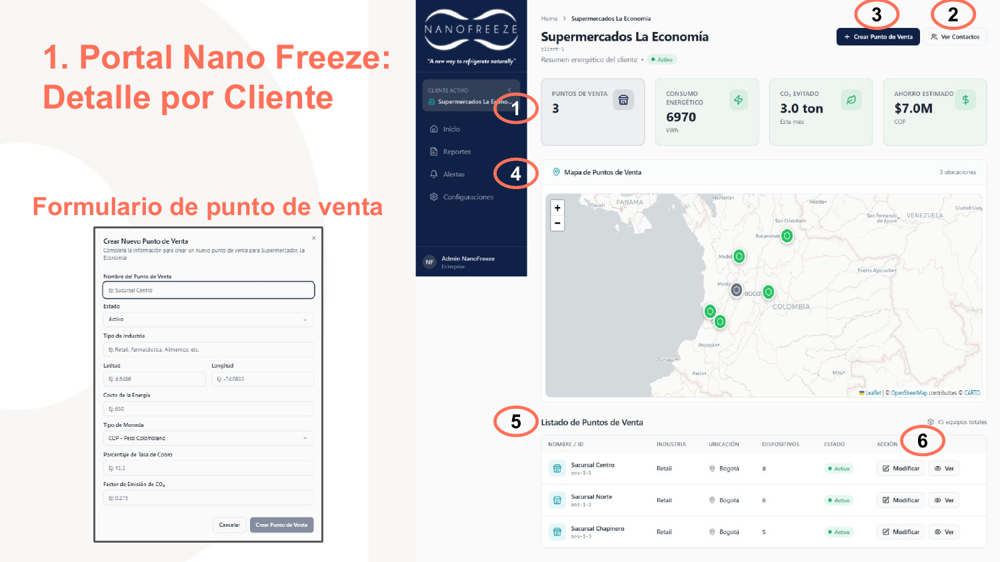

**Breadcrumb:** `Home > Supermercados La Economia`

**Encabezado:**
- Titulo: **"Supermercados La Economia"** (bold, ~22px)
- ID: `client-1`
- Subtitulo: *"Resumen energetico del cliente"* + badge ● Activo (verde)
- Botones superiores: **"+ Crear Punto de Venta"** (navy) | **"Ver Contactos"** (outlined con icono personas)

**Fila de tarjetas KPI (4 tarjetas):**

| Tarjeta | Etiqueta | Valor | Detalle | Icono |
|---------|----------|-------|---------|-------|
| 1 | PUNTOS DE VENTA | **3** | — | Tienda (teal) |
| 2 | CONSUMO ENERGETICO | **6970** | kWh | Rayo (teal) |
| 3 | CO₂ EVITADO | **3.0 ton** | Este mes | Hoja (teal) |
| 4 | AHORRO ESTIMADO | **$7.0M** | COP | Dolar (teal) |

**Mapa de Puntos de Venta:**
- Mapa Leaflet mostrando Colombia/Panama/Venezuela con zoom a Colombia central
- Marcadores circulares verdes en 3 ubicaciones (Bogota y alrededores)
- Controles de zoom (+/-) en esquina superior izquierda
- Indicador "3 ubicaciones" en esquina superior derecha
- Atribucion: *"Leaflet | © OpenStreetMap contributors © CARTO"*

**Tabla "Listado de Puntos de Venta":**
- Header derecho: *"45 equipos totales"*
- Columnas: `NOMBRE / ID` | `INDUSTRIA` | `UBICACION` | `DISPOSITIVOS` | `ESTADO` | `ACCION`

| Punto de Venta | Industria | Ubicacion | Dispositivos | Estado | Acciones |
|---------------|-----------|-----------|-------------|--------|----------|
| Sucursal Centro (pos-1-1) | Retail | Bogota | 8 | ● Activo | Modificar · Ver |
| Sucursal Norte (pos-1-2) | Retail | Bogota | 6 | ● Activo | Modificar · Ver |
| Sucursal Chapinero (pos-1-3) | Retail | Bogota | 5 | ● Activo | Modificar · Ver |

**Sidebar:** Muestra seccion "CLIENTE ACTIVO" con icono edificio + "Supermercados La Eco..." (truncado).

**Anotaciones (circulos rojos):**
1. KPI cards
2. Boton "Ver Contactos"
3. Boton "Crear Punto de Venta"
4. Sidebar con cliente activo
5. Tabla de puntos de venta
6. Acciones de la tabla

#### Formulario: Crear Nuevo Punto de Venta

**Modal centrado.** Titulo: **"Crear Nuevo Punto de Venta"**. Subtitulo: *"Completa la informacion para crear un nuevo punto de venta para Supermercados La Economia"*.

| Campo | Tipo | Placeholder |
|-------|------|-------------|
| Nombre del Punto de Venta | Text input | `Ej: Sucursal Centro` |
| Estado | Dropdown | `Activo` |
| Tipo de Industria | Text input | `Ej: Retail, Farmaceutica, Alimentos, etc.` |
| Latitud | Text input | `Ej: 4.6486` |
| Longitud | Text input | `Ej: -74.0833` |
| Costo de la Energia | Text input | `Ej: 650` |
| Tipo de Moneda | Dropdown | `COP - Peso Colombiano` |
| Porcentaje de Tasa de Cobro | Text input | `Ej: 10.5` |
| Factor de Emision de CO₂ | Text input | `Ej: 0.275` |

**Botones:** `Cancelar` | `Crear Punto de Venta`

---

### 1.3 Contactos del Cliente

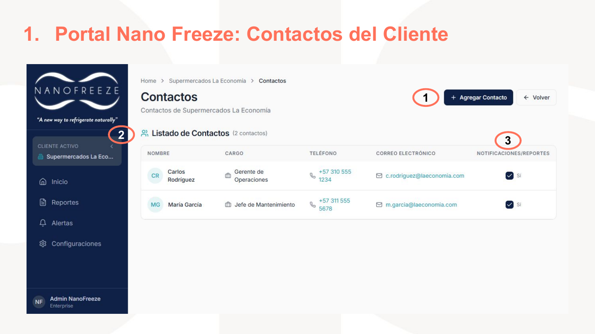

**Breadcrumb:** `Home > Supermercados La Economia > Contactos`

**Encabezado:**
- Titulo: **"Contactos"**
- Subtitulo: *"Contactos de Supermercados La Economia"*
- Botones: **"+ Agregar Contacto"** (fondo teal) | **"← Volver"** (outlined)

**Tabla "Listado de Contactos" (2 contactos):**
- Columnas: avatar circular (iniciales) | `NOMBRE` | `CARGO` | `TELEFONO` | `CORREO ELECTRONICO` | `NOTIFICACIONES/REPORTES`

| Avatar | Nombre | Cargo | Telefono | Correo | Notif. |
|--------|--------|-------|----------|--------|--------|
| CR | Carlos Rodriguez | Gerente de Operaciones | +57 310 555 1234 | c.rodriguez@laeconomia.com | ✅ Si |
| MG | Maria Garcia | Jefe de Mantenimiento | +57 311 555 5678 | m.garcia@laeconomia.com | ✅ Si |

**Anotaciones:**
1. Boton "Agregar Contacto"
2. Tabla de contactos
3. Columna de notificaciones/reportes (checkbox teal)

#### Formulario: Agregar Nuevo Contacto

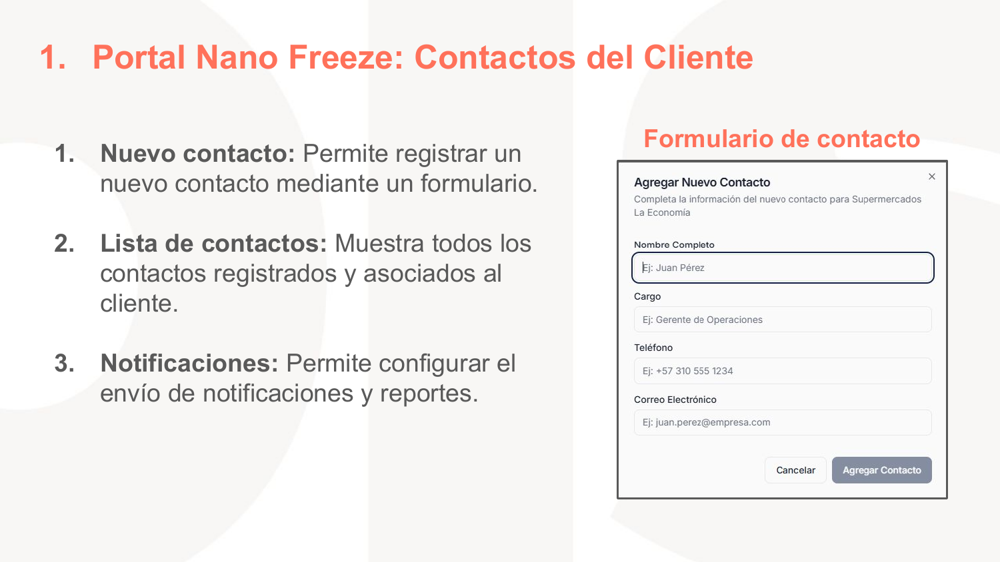

**Modal.** Titulo: **"Agregar Nuevo Contacto"**. Subtitulo: *"Completa la informacion del nuevo contacto para Supermercados La Economia"*.

| Campo | Tipo | Placeholder |
|-------|------|-------------|
| Nombre Completo | Text input | `Ej: Juan Perez` |
| Cargo | Text input | `Ej: Gerente de Operaciones` |
| Telefono | Text input | `Ej: +57 310 555 1234` |
| Correo Electronico | Text input | `Ej: juan.perez@empresa.com` |

**Botones:** `Cancelar` | `Agregar Contacto`

---

### 1.4 Detalle por Punto de Venta

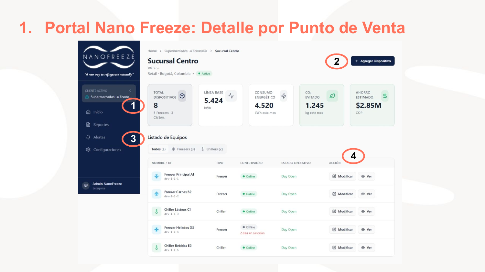

**Breadcrumb:** `Home > Supermercados La Economia > Sucursal Centro`

**Encabezado:**
- Titulo: **"Sucursal Centro"**
- ID: `pos-1-1`
- Info: `Retail · Bogota, Colombia · ● Activo`
- Boton: **"+ Agregar Dispositivo"** (fondo teal)

**Fila de tarjetas KPI (5 tarjetas):**

| Tarjeta | Etiqueta | Valor | Detalle | Icono |
|---------|----------|-------|---------|-------|
| 1 | TOTAL DISPOSITIVOS | **8** | 5 Freezers · 3 Chillers | Dispositivo (teal) |
| 2 | LINEA BASE | **5.424** | kWh | Grafica (teal) |
| 3 | CONSUMO ENERGETICO | **4.520** | kWh este mes | Rayo (teal) |
| 4 | CO₂ EVITADO | **1.245** | kg este mes | Hoja (teal) |
| 5 | AHORRO ESTIMADO | **$2.85M** | COP | Dolar (teal) |

**Tabla "Listado de Equipos":**
- Tabs de filtro: `Todos (5)` | `❄ Freezers (3)` | `🏭 Chillers (2)`
- Columnas: icono tipo | `NOMBRE / ID` | `TIPO` | `CONECTIVIDAD` | `ESTADO OPERATIVO` | `ACCION`

| Equipo | Tipo | Conectividad | Estado Operativo | Acciones |
|--------|------|-------------|-----------------|----------|
| ❄ Freezer Principal A1 (dev-1-1-1) | Freezer | ● Online | Day Open | Modificar · Ver |
| ❄ Freezer Carnes B2 (dev-1-1-2) | Freezer | ● Online | Day Open | Modificar · Ver |
| 🏭 Chiller Lacteos C1 (dev-1-1-3) | Chiller | ● Online | Day Open | Modificar · Ver |
| ❄ Freezer Helados D3 (dev-1-1-4) | Freezer | ● Offline (2 dias sin conexion) | Day Open | Modificar · Ver |
| 🏭 Chiller Bebidas E2 (dev-1-1-5) | Chiller | ● Online | Day Open | Modificar · Ver |

**Anotaciones:**
1. KPI cards
2. Boton "Agregar Dispositivo"
3. Tabla con tabs de filtro
4. Acciones

#### Formulario: Agregar Nuevo Dispositivo

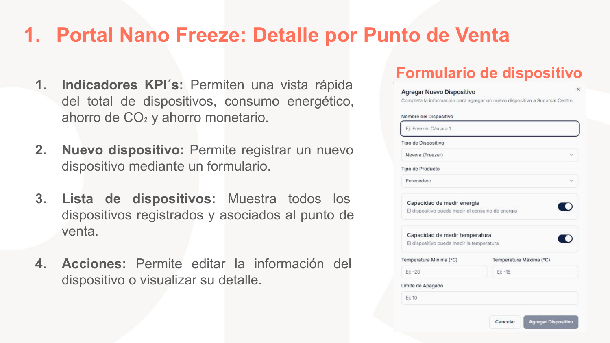

**Modal.** Titulo: **"Agregar Nuevo Dispositivo"**. Subtitulo: *"Completa la informacion para agregar un nuevo dispositivo a Sucursal Centro"*.

| Campo | Tipo | Placeholder / Default |
|-------|------|----------------------|
| Nombre del Dispositivo | Text input | `Ej: Freezer Camara 1` |
| Tipo de Dispositivo | Dropdown | `Nevera (Freezer)` |
| Tipo de Producto | Dropdown | `Perecedero` |
| Capacidad de medir energia | Toggle switch | ON (con descripcion: *"El dispositivo puede medir el consumo de energia"*) |
| Capacidad de medir temperatura | Toggle switch | ON (con descripcion: *"El dispositivo puede medir la temperatura"*) |
| Temperatura Minima (°C) | Text input | `Ej: -20` |
| Temperatura Maxima (°C) | Text input | `Ej: -15` |
| Limite de Apagado | Text input | `Ej: 10` |

**Botones:** `Cancelar` | `Agregar Dispositivo`

---

### 1.5 Detalle por Equipo

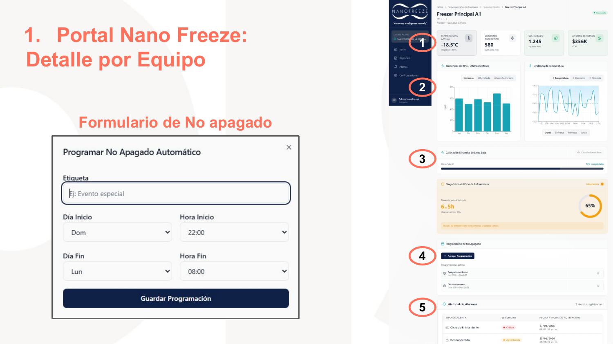

**Breadcrumb:** `Home > Supermercados La Economia > Sucursal Centro > Freezer Principal A1`

**Encabezado:**
- Titulo: **"Freezer Principal A1"**
- ID: `dev-1-1-1`
- Info: `Freezer · Sucursal Centro`
- Badge superior derecho: ● Conectado (verde)

**Fila de tarjetas KPI (4 tarjetas):**

| Tarjeta | Etiqueta | Valor | Detalle | Icono |
|---------|----------|-------|---------|-------|
| 1 | TEMPERATURA ACTUAL | **-18.5°C** | Objetivo: -18°C | Termometro |
| 2 | CONSUMO ENERGETICO | **580** | kWh este mes | Rayo |
| 3 | CO₂ EVITADO | **1.245** | kg este mes | Hoja |
| 4 | AHORRO ESTIMADO | **$356K** | COP | Dolar |

**Seccion de Graficas — "Tendencias de KPIs - Ultimos 6 Meses":**

Grafica izquierda — **Grafica de barras (teal/turquesa):**
- Tabs: `Consumo` | `CO₂ Evitado` | `Ahorro Monetario`
- Eje Y: kWh (0 a ~800)
- Eje X: meses (Sep, Oct, Nov, Dic, Ene, Feb)
- Barras turquesa con valores crecientes

Grafica derecha — **"Tendencia de Temperatura":**
- Tabs: `Temperatura` | `Consumo` | `Potencia`
- Sub-tabs: `Diario` | `Semanal` | `Mensual` | `Anual`
- Grafica de linea azul claro con oscilaciones entre -20°C y 0°C
- Eje X: horas del dia (1:00, 2:00... 22:00, 23:00)

**Seccion "Calibracion Dinamica de Linea Base":**
- Barra de progreso teal: "Dia 27 de 30" — badge **"73% completado"** (verde)
- Boton: "Calcular Linea Base" (a la derecha)

**Seccion "Diagnostico del Ciclo de Enfriamiento":**
- Badge superior derecho: **"Advertencia"** (naranja)
- Dato principal: **6.5h** (rojo/coral) — *"Duracion actual del ciclo"*
- Texto: *"Umbral critico: 10h"*
- Grafico circular (donut) a la derecha: **65%** en naranja/ambar
- Alerta: *"El ciclo de enfriamiento esta proximo al umbral critico"* (fondo naranja claro)

**Seccion "Programacion de No Apagado":**
- Boton: **"+ Agregar Programacion"** (teal)
- Programaciones activas (lista con icono reloj):
  - "Apagado nocturno" — `Lun 22:00 → Mar 06:00` (x para eliminar)
  - "Dia de descanso" — `Sab 5:00 → Dom 06:00` (x para eliminar)

**Seccion "Historial de Alarmas" (2 alertas registradas):**

| Tipo de Alerta | Severidad | Fecha y hora |
|---------------|-----------|--------------|
| Ciclo de Enfriamiento | ● Critica (rojo) | 27/01/2026 |
| Desconectado | ● Advertencia (naranja) | 25/01/2026 |

**Anotaciones:**
1. KPIs
2. Graficas
3. Calibracion de linea base + diagnostico ciclo
4. Programacion de no apagado
5. Historial de alarmas

#### Formulario: Programar No Apagado Automatico

**Modal.** Titulo: **"Programar No Apagado Automatico"**.

| Campo | Tipo | Placeholder / Default |
|-------|------|----------------------|
| Etiqueta | Text input | `Ej: Evento especial` |
| Dia Inicio | Dropdown | `Dom` |
| Hora Inicio | Dropdown | `22:00` |
| Dia Fin | Dropdown | `Lun` |
| Hora Fin | Dropdown | `08:00` |

**Boton:** `Guardar Programacion` (fondo coral/salmon, ancho completo, texto blanco)

---

### 1.6 Reporte

#### Paso 1: Seleccionar Cliente

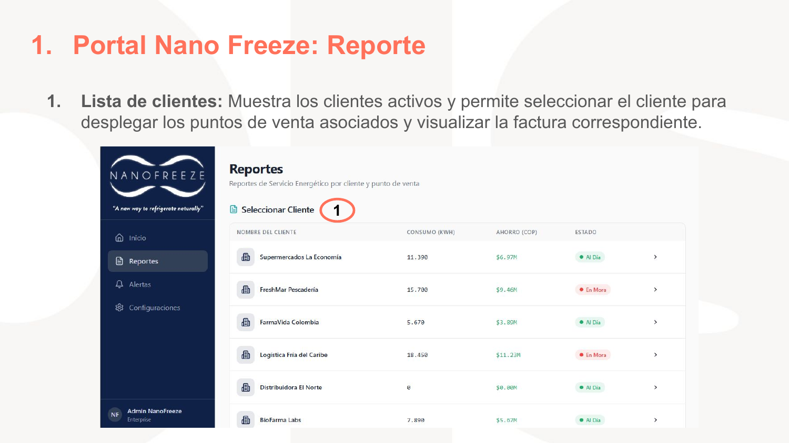

**Encabezado:**
- Titulo: **"Reportes"**
- Subtitulo: *"Reportes de Servicio Energetico por cliente y punto de venta"*

**Seccion "Seleccionar Cliente"** (icono documento):
- Tabla expandible con columnas: `NOMBRE DEL CLIENTE` | `CONSUMO (KWH)` | `AHORRO (COP)` | `ESTADO`

| Cliente | Consumo | Ahorro | Estado |
|---------|---------|--------|--------|
| Supermercados La Economia | 11,390 | $6.97M | ● Al Dia (verde) |
| FreshMar Pescaderia | 15,700 | $9.46M | ● En Mora (rojo) |
| FarmaVida Colombia | 5,670 | $3.80M | ● Al Dia |
| Logistica Fria del Caribe | 18,450 | $11.23M | ● En Mora |
| Distribuidora El Norte | 0 | $0.00M | ● Al Dia |
| BioFarma Labs | 7,890 | $5.67M | ● Al Dia |

- Cada fila tiene flecha `>` para expandir/navegar.

#### Paso 2: Seleccionar Punto de Venta

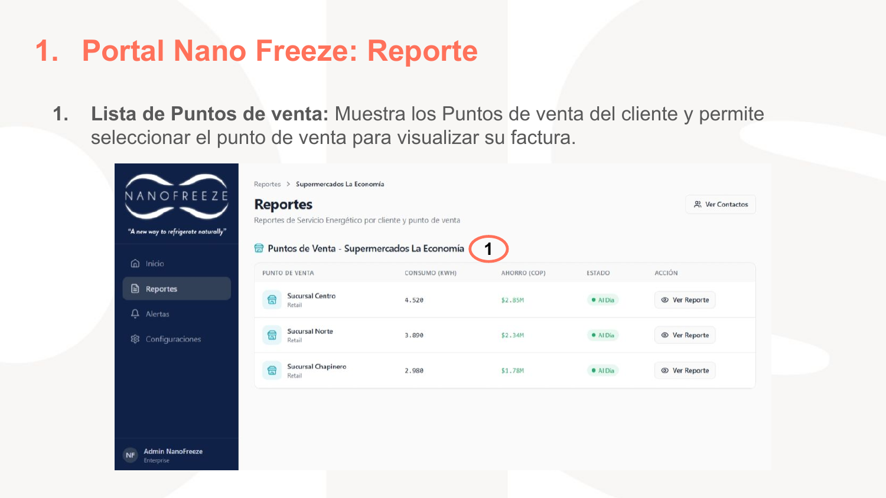

**Breadcrumb:** `Reportes > Supermercados La Economia`

- Boton "Ver Contactos" (esquina superior derecha)
- Seccion: **"Puntos de Venta - Supermercados La Economia"**
- Columnas: `PUNTO DE VENTA` | `CONSUMO (KWH)` | `AHORRO (COP)` | `ESTADO` | `ACCION`

| Punto de Venta | Consumo | Ahorro | Estado | Accion |
|---------------|---------|--------|--------|--------|
| Sucursal Centro (Retail) | 4,520 | $2.85M | ● Al Dia | Ver Reporte |
| Sucursal Norte (Retail) | 3,890 | $2.34M | ● Al Dia | Ver Reporte |
| Sucursal Chapinero (Retail) | 2,980 | $1.78M | ● Al Dia | Ver Reporte |

#### Paso 3: Seleccionar Mes

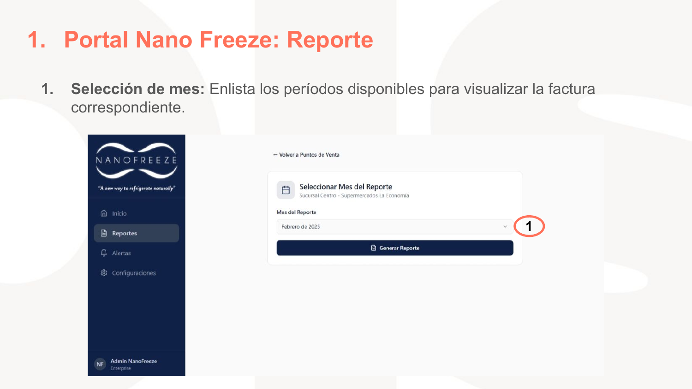

- Link: *"← Volver a Puntos de Venta"*
- Card centrada con icono calendario:
  - Titulo: **"Seleccionar Mes del Reporte"**
  - Subtitulo: *"Sucursal Centro - Supermercados La Economia"*
  - Campo: **"Mes del Reporte"** — Dropdown: `Febrero de 2025`
  - Boton: **"Generar Reporte"** (fondo navy, ancho completo, icono documento)

#### Paso 4: Vista de Factura/Reporte

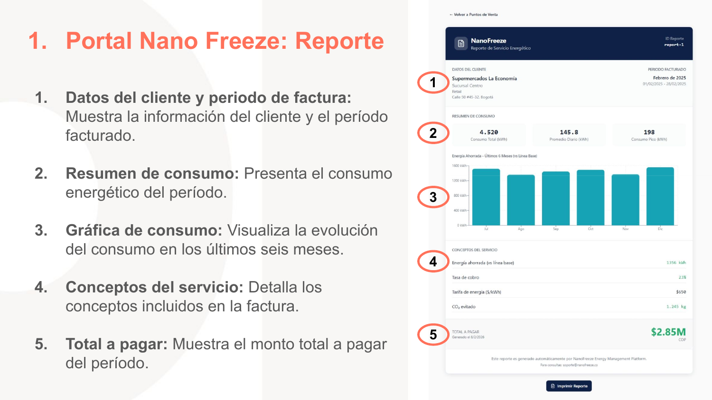

**Layout del reporte (card blanca con estructura de factura):**

**Header (barra navy oscuro):**
- Logo NanoFreeze (blanco) + **"NanoFreeze"** + *"Reporte de Servicio Energetico"*
- Derecha: `ID Reporte: report-1`

**Seccion 1 — Datos del Cliente:**
- Izquierda: `DATOS DEL CLIENTE` — Supermercados La Economia, Sucursal Centro, Retail, Calle 50 #45-32, Bogota
- Derecha: `PERIODO FACTURADO` — **Febrero de 2025** — 01/02/2025 - 28/02/2025

**Seccion 2 — Resumen de Consumo:**
- Tres metricas en linea:
  - **4.520** Consumo Total (kWh)
  - **145.8** Promedio Diario (kWh)
  - **198** Consumo Pico (kWh)

**Seccion 3 — Grafica de consumo:**
- Titulo: *"Energia Ahorrada - Ultimos 6 Meses (vs Linea Base)"*
- Grafica de barras teal/turquesa, 6 barras (Jul, Ago, Sep, Oct, Nov, Dic)
- Eje Y: 0 a 1600 kWh
- Barras oscilan entre ~800 y ~1400 kWh

**Seccion 4 — Conceptos del Servicio:**

| Concepto | Valor |
|----------|-------|
| Energia ahorrada (vs linea base) | 1356 kWh |
| Tasa de cobro | 23% |
| Tarifa de energia ($/kWh) | $650 |
| CO₂ evitado | 1.245 kg |

**Seccion 5 — Total a Pagar:**
- `TOTAL A PAGAR` — Generado el 8/2/2026
- **$2.85M** COP (grande, verde)

**Pie:** *"Este reporte es generado automaticamente por NanoFreeze Energy Management Platform. Para consultas: soporte@nanofreeze.co"*

**Boton:** `Imprimir Reporte` (icono impresora)

---

### 1.7 Alertas

**Encabezado:**
- Titulo: **"Alertas"**
- Subtitulo: *"Monitoreo centralizado de alertas de todos los clientes"*
- Badges superiores derechos: **"△ 1 Criticas"** (rojo) | **"◇ 2 Advertencias"** (naranja)

**Seccion "Alertas Activas" (3):**
- Columnas: `CLIENTE` | `EQUIPO` | `TIPO DE ALERTA` | `SEVERIDAD` | `FECHA Y HORA` | `ACCION`

| Cliente | Equipo | Tipo | Severidad | Fecha | Accion |
|---------|--------|------|-----------|-------|--------|
| Supermercados La Economia | ❄ Freezer Helados D3 | Sin Conexion | ◇ Advertencia (naranja) | 6/2/2026 6:09:31 p.m. | Ver Equipo |
| Supermercados La Economia | ❄ Freezer Helados D3 | Ciclo de Enfriamiento | △ Critico (rojo) | 8/2/2026 5:09:31 p.m. | Ver Equipo |
| Logistica Fria del Caribe | ❄ Freezer Camara 12 | Consumo Energetico | ◇ Advertencia (naranja) | 8/2/2026 1:09:31 p.m. | Ver Equipo |

**Anotaciones:**
1. Tabla de alertas activas
2. Boton "Ver Equipo" en columna accion

---

## 2. Portal Clientes

> Seccion separadora: pagina 18 — texto grande coral *"2. Portal Clientes"*

El Portal Clientes comparte el mismo sistema de diseno (sidebar, KPIs, tablas, graficas) pero con funcionalidades reducidas. Las diferencias clave se describen a continuacion.

### 2.1 Detalle por Cliente

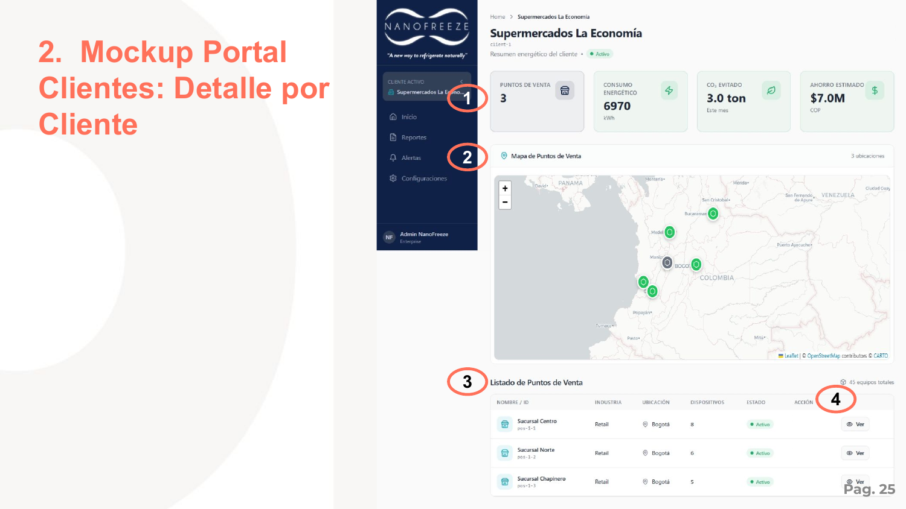

**Identico al admin (seccion 1.2) excepto:**
- **Sin boton "Crear Punto de Venta"** — el cliente no puede crear nuevos puntos
- **Sin boton "Ver Contactos"**
- Columna de acciones solo muestra **"Ver"** (sin "Modificar")
- KPIs identicos: Puntos de Venta (3), Consumo Energetico (6970 kWh), CO₂ Evitado (3.0 ton), Ahorro Estimado ($7.0M COP)
- Mapa Leaflet identico con marcadores verdes

**Anotaciones:**
1. KPI cards
2. Mapa
3. Tabla de puntos de venta
4. Solo accion "Ver"

### 2.2 Detalle por Punto de Venta

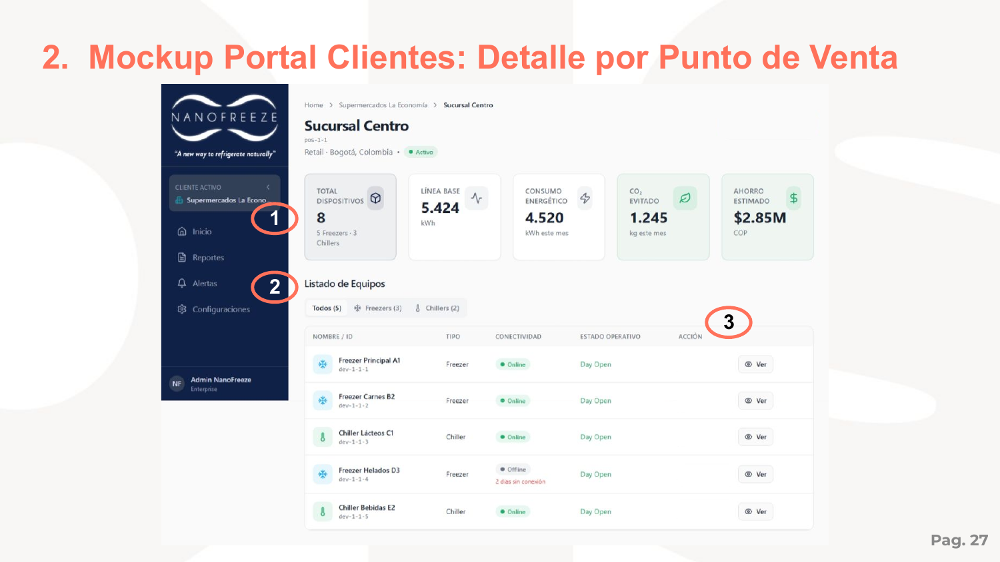

**Identico al admin (seccion 1.4) excepto:**
- **Sin boton "Agregar Dispositivo"**
- Columna de acciones solo muestra **"Ver"** (sin "Modificar")
- KPIs identicos: Total Dispositivos (8), Linea Base (5.424 kWh), Consumo Energetico (4.520 kWh), CO₂ Evitado (1.245 kg), Ahorro Estimado ($2.85M COP)
- Tabs de filtro: Todos (5) | Freezers (3) | Chillers (2)

**Anotaciones:**
1. KPI cards
2. Tabla de dispositivos
3. Solo accion "Ver"

### 2.3 Detalle por Equipo

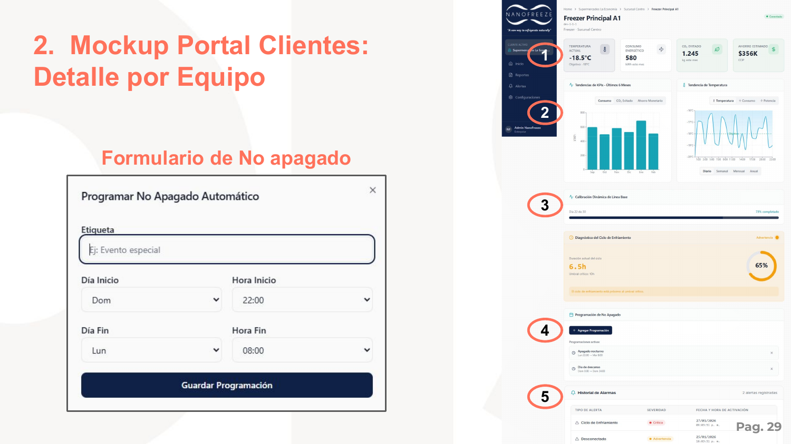

**Identico al admin (seccion 1.5)** con las mismas secciones:
- KPIs: Temperatura (-18.5°C), Consumo (580 kWh), CO₂ Evitado (1.245 kg), Ahorro ($356K COP)
- Graficas de tendencia (barras teal + linea temperatura)
- Calibracion de linea base (73% completado) — **solo visualizacion, sin boton "Calcular"**
- Diagnostico del ciclo de enfriamiento (6.5h, 65%)
- Programacion de No Apagado (misma funcionalidad)
- Historial de Alarmas

**Formulario de No Apagado:** Identico al del admin.

### 2.4 Reporte

**Diferencia principal:** No hay paso de seleccion de cliente — el cliente ya esta fijado.

**Paso 1: Seleccionar Punto de Venta** — identico a seccion 1.6 paso 2

**Paso 2: Seleccionar Mes** — identico a seccion 1.6 paso 3

**Paso 3: Vista de Factura** — identica a seccion 1.6 paso 4

### 2.5 Alertas

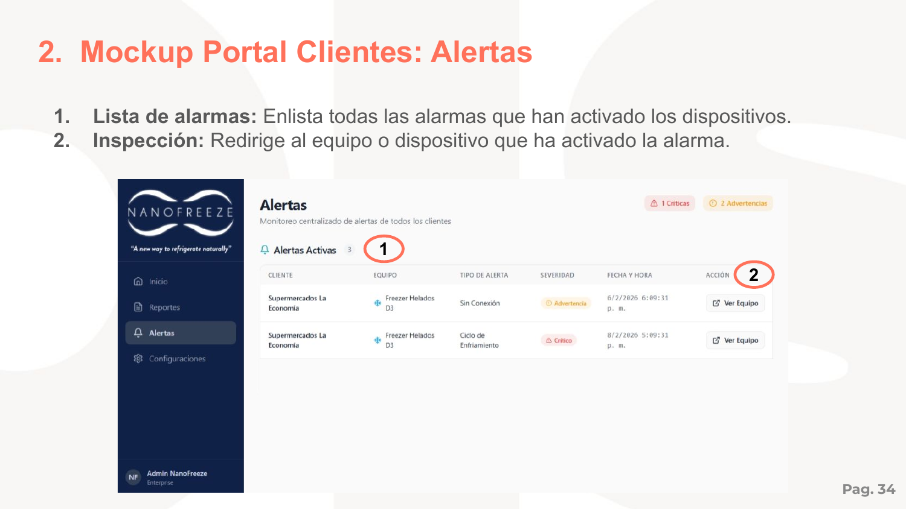

**Identico al admin (seccion 1.7) excepto:**
- Solo muestra alertas del propio cliente (2 alertas en ejemplo vs 3 en admin)
- Mismos badges: "1 Criticas" + "2 Advertencias"
- Tabla sin columna "CLIENTE" (ya se sabe cual es)

---

## 3. Portal Calculadora

> Seccion separadora: pagina 29 — texto grande coral *"3. Portal Calculadora"*

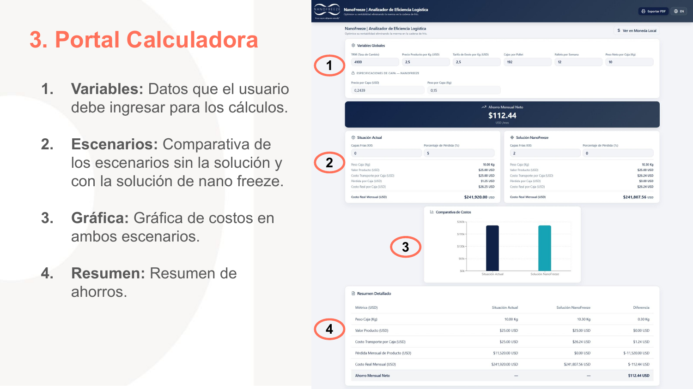

**Layout:** Sin sidebar. Barra superior navy con logo NanoFreeze + **"NanoFreeze | Analizador de Eficiencia Logistica"** + subtitulo *"Optimice su rentabilidad eliminando la merma en la cadena de frio"*. Botones superiores: `Exportar PDF` | `EN` (idioma).

**Header secundario:** *"NanoFreeze | Analizador de Eficiencia Logistica"* + link **"$ Ver en Moneda Local"**

### Seccion 1 — Variables Globales

**Tabla de inputs en fila horizontal:**

| Campo | Valor ejemplo |
|-------|--------------|
| TRM (Tasa de Cambio) | 4100 |
| Precio Producto por Kg (USD) | 2,5 |
| Tarifa de Envio por Kg (USD) | 2,5 |
| Cajas por Pallet | 192 |
| Pallets por Semana | 12 |
| Peso Neto por Caja (Kg) | 10 |

**Sub-seccion "Especificaciones de Capa — NANOFREEZE":**

| Campo | Valor ejemplo |
|-------|--------------|
| Precio por Capa (USD) | 0,2439 |
| Peso por Capa (Kg) | 0,15 |

### Resultado destacado

**Barra navy con texto blanco:** "↗ **Ahorro Mensual Neto** — **$112.44** USD /mes"

### Seccion 2 — Escenarios (lado a lado)

Dos paneles comparativos:

**Panel izquierdo — "Situacion Actual":**
- Capas Frias XXS: `0`
- Porcentaje de Perdida (%): `5`
- Resultado:
  - Peso Caja (Kg): 10.00 Kg
  - Valor Producto (USD): $25.00 USD
  - Costo Transporte por Caja (USD): $25.00 USD
  - Perdida por Caja (USD): $1.25 USD
  - Costo Real por Caja (USD): $26.25 USD
  - **Costo Real Mensual (USD): $241,920.00 USD**

**Panel derecho — "Solucion NanoFreeze":**
- Capas Frias XXS: `2`
- Porcentaje de Perdida (%): `0`
- Resultado:
  - Peso Caja (Kg): 10.30 Kg
  - Valor Producto (USD): $25.00 USD
  - Costo Transporte por Caja (USD): $26.24 USD
  - Perdida por Caja (USD): $0.00 USD
  - Costo Real por Caja (USD): $26.24 USD
  - **Costo Real Mensual (USD): $241,807.56 USD**

### Seccion 3 — Comparativa de Costos (Grafica)

- Grafica de barras comparativa con 2 grupos
- Eje Y: $0 a ~$260K
- Grupo 1: "Situacion Actual" — 2 barras (una teal, una azul mas oscuro)
- Grupo 2: "Solucion NanoFreeze" — 2 barras similares, ligeramente mas bajas

### Seccion 4 — Resumen Detallado

**Tabla con 3 columnas de comparacion:**

| Metrica (USD) | Situacion Actual | Solucion NanoFreeze | Diferencia |
|--------------|-----------------|--------------------|-----------:|
| Peso Caja (Kg) | 10.00 Kg | 10.30 Kg | 0.30 Kg |
| Valor Producto (USD) | $25.00 USD | $25.00 USD | $0.00 USD |
| Costo Transporte por Caja (USD) | $25.00 USD | $26.24 USD | $1.24 USD |
| Perdida Mensual de Producto (USD) | $11,520.00 USD | $0.00 USD | -$11,520.00 USD |
| Costo Real Mensual (USD) | $241,920.00 USD | $241,807.56 USD | -$112.44 USD |
| **Ahorro Mensual Neto** | — | — | **$112.44 USD** |

---

## Diferencias entre Portales

| Caracteristica | Portal NanoFreeze (Admin) | Portal Clientes |
|----------------|--------------------------|-----------------|
| Crear/editar clientes | Si | No |
| Crear/editar puntos de venta | Si | No |
| Crear/editar dispositivos | Si | Si (limitado) |
| Ver todos los clientes | Si | No (solo el propio) |
| Calibrar linea base | Iniciar y gestionar | Solo visualizar |
| Programar No Apagados | Si | Si |
| Ver reportes/facturas | Todos los clientes | Solo los propios |
| Ver alertas | Todas | Solo las propias |
| Seleccionar cliente en reportes | Si (paso adicional) | No (fijado) |
| Acciones en tablas | Modificar + Ver | Solo Ver |
| Boton "Ver Contactos" | Si | No |
